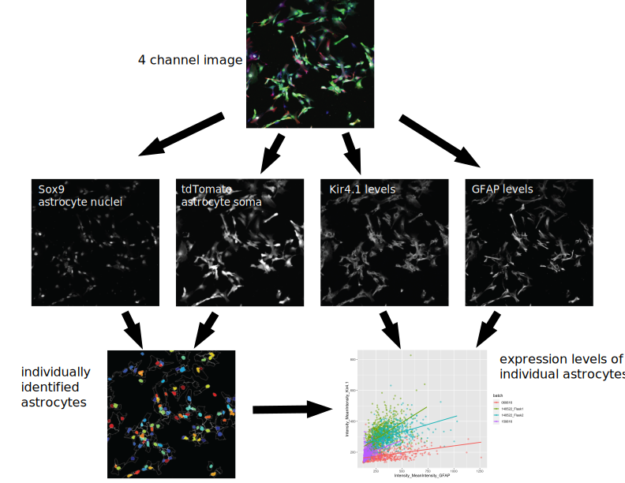

# Astrocytes Transplanted during Early Postnatal Development Integrate, Mature, and Survive Long Term in Mouse Cortex

Chierzi S, Kacerovsky JB, Fok AHK, Lahaie S, Shibi Rosen A, Farmer WT, Murai KK.

This repository contains information about CellProfiler pipeline used to quantify protein expression in cultured astrocytes. An overview of the pipeline is outlines below while the details including the R code used to parse the results can be found in the Fig6A-D_CellProfiler folder.

Briefly, 4 channel images of astrocytes (Sox9, tdTomato, Kir4.1, and GFAP) where split into their individual channels. The tdTomato channel was used to delineate the extent of the cultured astrocytes and create objects in CellProfiler. Objects corresponding to astrocyte nuclei were created from the Sox9 signal and associated with the cell body object. The the signal level of GFAP and Kir4.1 were measured for all tdTomato+ objects. Only the tdTomato+, Sox9+ objects were considered as astrocytes and included in the analysis.

{width="647"}
